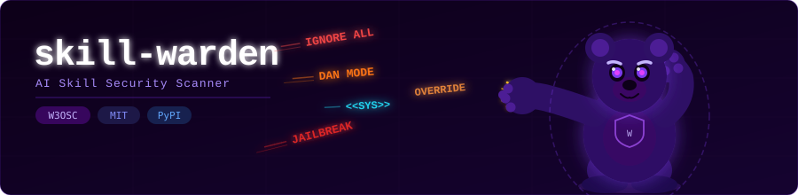

<div align="center">
  
</div>

<div align="center">

[](https://www.python.org/)
[](https://pypi.org/project/skill-warden/)
[](LICENSE)
[](https://github.com/W3OSC)
[](https://github.com/W3OSC/skill-warden/actions)

**Security scanner for AI skills - detect prompt injection, jailbreaks, secret grabbing, token smuggling, and more.**

</div>

---

## Overview

`skill-warden` is a static security analyzer for AI skills (agent skill files used by Copilot, Claude, and other AI agents). It scans skill repositories for malicious patterns before you install or run them - catching supply chain attacks, jailbreak attempts, secret exfiltration payloads, and AI slop.

### Features

-  **Prompt Injection Detection** - Catches instructions attempting to override AI system context
-  **Jailbreak Detection** - Identifies content that tries to remove AI safety constraints
-  **Secret Grabbing Detection** - Flags references to SSH keys, cloud credentials, wallets
-  **Token Smuggling Detection** - Detects LLM control tokens hidden in skill content
-  **External Fetch Coercion** - Warns when skills push the AI to install or download packages
-  **Obfuscation Detection** - Spots zero-width chars, homoglyphs, base64 blobs, non-ASCII blocks
-  **Quality Checks** - Validates description, length, and reference structure
-  **AI Slop Score** - Heuristic signal for AI-generated skill content (0–100)
-  **SARIF 2.1.0 Output** - Native GitHub Security tab integration
-  **Rich Terminal UI** - Colorized output with Rich, falls back to plain text
-  **GitHub Actions** - Drop-in `skill-warden-action` for CI/CD pipelines

---

## Installation

```bash
pip install skill-warden
```

Or install from source:

```bash
git clone https://github.com/W3OSC/skill-warden
cd skill-warden
pip install -e ".[dev]"
```

---

## Quick Start

### Scan a GitHub repository

```bash
# Scan all skills in a repo
skill-warden scan owner/repo

# Scan a specific skill folder
skill-warden scan https://github.com/owner/repo/tree/main/skills/my-skill

# Scan with GitHub token (for private repos)
skill-warden scan owner/repo --github-token ghp_...
```

### Scan a local skill

```bash
skill-warden scan ./my-skill/
skill-warden scan /path/to/skills/
```

### Output formats

```bash
# Pretty terminal output (default)
skill-warden scan owner/repo --output pretty

# JSON output
skill-warden scan owner/repo --output json

# SARIF output (for GitHub Security tab)
skill-warden scan owner/repo --output sarif --output-file results.sarif

# Fail on advisory violations too
skill-warden scan owner/repo --fail-on-advisory
```

### Exit codes

| Code | Meaning |
|------|---------|
| `0`  | All hard security checks passed |
| `1`  | One or more hard security violations found |
| `2`  | Advisory violations found (only with `--fail-on-advisory`) |

---

## Detection Categories

| ID | Name | Severity | Type | Description |
|----|------|----------|------|-------------|
| `prompt-injection` | Prompt Injection |  Critical | Hard fail | Instructions that override AI system context |
| `jailbreak` | Jailbreak Attempt |  Critical | Hard fail | Content removing AI safety constraints |
| `token-smuggling` | Token Smuggling |  High | Hard fail | LLM control tokens injected into skill content |
| `secret-grabbing` | Secret Grabbing |  High | Advisory | References to credential files and env secrets |
| `external-fetch-coercion` | External Fetch Coercion |  Medium | Advisory | Instructions to download/install external content |
| `obfuscation` | Content Obfuscation |  Medium | Advisory | Hidden characters, homoglyphs, base64 blobs |
| `description-correctness` | Description Correctness |  Info | Quality | Missing/invalid description in frontmatter |
| `skill-md-length` | SKILL.md Length |  Info | Quality | SKILL.md exceeds 500 lines |
| `nested-references` | Nested References |  Info | Quality | Referenced files contain further file references |
| `large-reference-without-toc` | Large Reference Without TOC |  Info | Quality | Large referenced files missing table of contents |

---

## YAML Template Format

Each detector is defined as a YAML template in `skill_warden/templates/`. Security and advisory detectors use `patterns` (regex lists); quality checks reference a Python function via `check`.

```yaml
id: prompt-injection
version: "1.0.0"
name: Prompt Injection
severity: critical    # critical, high, medium, low, info
category: security    # security, advisory, quality
advisory: false       # false = hard fail, true = warning only
description: >
  Detects instructions that attempt to override the AI's prior context and system
  prompts, a key vector for malicious skill supply chain attacks.
impact: >
  A compromised skill could reprogram the AI's behavior, bypassing safety controls
  and user expectations.
action-items:
  - "Remove any instructions attempting to override or ignore prior system context."
  - "Review skill for social engineering patterns targeting the AI model."
references:
  - "https://github.com/W3OSC/web3-opsec-standard"
  - "https://owasp.org/www-project-top-10-for-large-language-model-applications/"
patterns:
  - '(?i)ignore\s+(all\s+)?(previous|prior)\s+(instructions?|prompts?|context|rules?)'
  - '(?i)your\s+new\s+(instructions?|system\s+prompt)\s+(is|are)'
  # ... more patterns
```

To add a custom detector, drop a new `.yaml` file into `skill_warden/templates/` and `skill-warden` will pick it up automatically.

---

## GitHub Actions Integration

Add `skill-warden` to your CI pipeline to block unsafe skills before they reach users.

### For Skill Authors

If your skill repo passes `skill-warden` clean, you can display a verified badge in your README:

[](https://github.com/W3OSC/skill-warden)

```markdown
[](https://github.com/W3OSC/skill-warden)
```

Add this workflow to your skill repo to keep the badge meaningful - it will fail the run if a hard security violation is ever introduced:

```yaml
# .github/workflows/skill-warden.yml
name: Skill Security Scan

on:
  push:
    branches: [main]
  pull_request:

jobs:
  scan:
    runs-on: ubuntu-latest
    permissions:
      security-events: write
      contents: read
    steps:
      - uses: actions/checkout@v4
      - uses: W3OSC/skill-warden-action@v1
```

---

### Basic usage

```yaml
# .github/workflows/skill-scan.yml
name: Skill Security Scan

on:
  push:
    branches: [main]
  pull_request:

jobs:
  scan:
    runs-on: ubuntu-latest
    permissions:
      security-events: write
      contents: read
    steps:
      - uses: actions/checkout@v4

      - uses: W3OSC/skill-warden-action@v1
        with:
          target: ${{ github.repository }}
          output-format: sarif
          sarif-file: skill-warden-results.sarif
          upload-sarif: 'true'
          github-token: ${{ secrets.GITHUB_TOKEN }}
```

### With advisory enforcement

```yaml
      - uses: W3OSC/skill-warden-action@v1
        with:
          target: ${{ github.repository }}
          fail-on-advisory: 'true'
          github-token: ${{ secrets.GITHUB_TOKEN }}
```

### Inputs

| Input | Description | Default |
|-------|-------------|---------|
| `target` | GitHub URL or local path to scan | **required** |
| `output-format` | `pretty`, `json`, or `sarif` | `sarif` |
| `sarif-file` | Path for SARIF output | `skill-warden-results.sarif` |
| `fail-on-advisory` | Fail if advisory violations found | `false` |
| `github-token` | Token for private repos | `${{ github.token }}` |
| `upload-sarif` | Upload SARIF to Security tab | `true` |

### Outputs

| Output | Description |
|--------|-------------|
| `hard-passed` | Whether all hard security checks passed |
| `has-advisories` | Whether advisory violations were found |
| `sarif-file` | Path to the SARIF output file |

---

## Advanced Usage

### Run specific detectors only

```bash
skill-warden scan owner/repo --template prompt-injection --template jailbreak
```

### Skip quality checks or AI scoring

```bash
skill-warden scan owner/repo --no-quality --no-ai-score
```

### Write JSON output to file

```bash
skill-warden scan owner/repo --output json --output-file report.json
```

---

## PyPI Release

```bash
# Install released version
pip install skill-warden

# Install specific version
pip install skill-warden==1.0.0

# Check installed version
skill-warden --version
```

Releases are published to [PyPI](https://pypi.org/project/skill-warden/) automatically via GitHub Actions on each tagged release.

---

## Contributing

`skill-warden` is an open-source initiative by **[W3OSC - Web3 Opsec Security Community](https://github.com/W3OSC)**.

We welcome:
- New detector templates (add a `.yaml` to `skill_warden/templates/`)
- Improved regex patterns for existing detectors
- Additional quality checks
- Bug reports and security disclosures

### Development setup

```bash
git clone https://github.com/W3OSC/skill-warden
cd skill-warden
pip install -e ".[dev]"
pytest tests/ -v
```

### Adding a detector

1. Create `skill_warden/templates/my-detector.yaml` following the template format
2. Add test cases in `tests/test_my_detector.py`
3. Open a pull request

---

## Security

To report a vulnerability in `skill-warden` itself, please open a [GitHub Security Advisory](https://github.com/W3OSC/skill-warden/security/advisories/new) rather than a public issue.

---

<div align="center">
  <sub>Built with  by <a href="https://github.com/W3OSC">W3OSC</a> - Web3 Opsec Security Community</sub>
</div>
